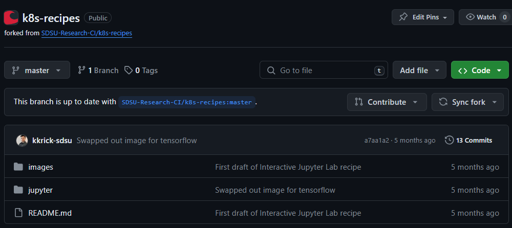
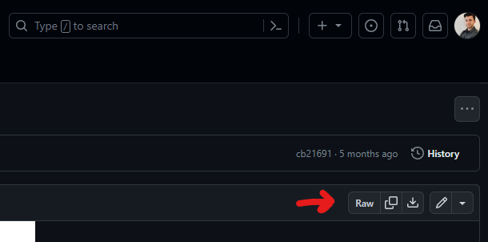
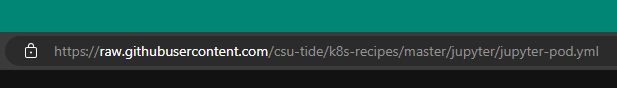

# Kubernetes (k8s) Recipes
This repository is a collection of "recipes" to accomplish specific tasks on Kubernetes-based systems. This repo aims to increase the accessibility and usability of the compute resources available on VERNE and the larger National Research Platform Nautilus.

This repo assumes that you do have familiarity with the following:
- Linux
- Commandline
- Git

## Context for Containers and Kubernetes
If you are not familiar with them, software containers are software applications that have been packaged with all of their dependencies which includes the operating system, runtime environment and libraries. Containers allow for isolated runtime environments, consistent & reproducible execution, and portability from desktop to cluster or cloud. Containers are like virtual machines (VMs), but smaller and optimized to the software application.

Kubernetes, often shortened to 'k8s', is a container orchestration platform that runs many containers at scale. Kubernetes manages each container's compute needs including CPUs, GPUs, memory, storage and networking. Kubernetes is like the operating system for containers.

## Getting Started
In order to follow along with the examples in this repo, you will first need to get access to VERNE and request access to or creation of a namespace. A Kubernetes namespace allows shared access to containers and other resources. Namespaces can be created for individuals or groups (i.e. for a class, lab or research center).

Follow the [Getting Access](https://sdsu-research-ci.github.io/softwarefactory/gettingaccess#getting-access) directions to get access to VERNE and a namespace. 

The above directions will guide you through the following steps: 
- Creating an account on the National Research Platform
- Downloading your kube config file
- Requesting access to or creation of a namespace

### Using JupyterHub on VERNE
This section coming soon!

### Using Your Local Machine
This section coming soon!

## Cloning this Repo
You can clone this entire repo if you would like to have a copy of all the recipes. You can then periodically perform a `git fetch` to check for updates, and you can download the updates with a `git pull`.
- Note: A `git pull` may conflict with your local changes. If you wish to maintain your own changes, consider [forking](https://docs.github.com/en/get-started/quickstart/fork-a-repo) this repo instead.

To clone this repo just follow these steps:
1. Via commandline, navigate to where you want to clone this repo
1. Run the following command:
    ```bash
    git clone https://github.com/SDSU-Research-CI/k8s-recipes.git
    ```
1. Verify that you successfully cloned the repo with `git status`:
    ```bash
    $ git status
    On branch master
    Your branch is up to date with 'origin/master'.
    ```

## Downloading Individual Files
Just need one specific file? No problem! Just follow these steps to get one file at a time:

1. Navigate the repo directory structure to get to the file you are interested in
    - 
1. In the upper right corner of the file viewer, click "Raw"
    - 
1. Copy the URL from your browser's address bar
    - 
1. Navigate to the system that you wish to download the file to
1. Use an http client to download the file
    - Example using curl
        ```bash
        curl -O https://raw.githubusercontent.com/SDSU-Research-CI/ic-intro/main/notebooks/analysis.ipynb
        ```
    - Example using wget
        ```bash
        wget https://raw.githubusercontent.com/SDSU-Research-CI/ic-intro/main/notebooks/analysis.ipynb
        ```
1. Make sure that the file downloaded successfully with `ls -la`:
    ```bash
    $ ls -la
    total 88
    drwxr-xr-x  5 kkrick kkrick  4096 Oct 18 14:27 .
    drwxr-xr-x 20 kkrick kkrick  4096 Oct 11 08:10 ..
    -rw-r--r--  1 kkrick kkrick 64110 Oct 18 14:27 analysis.ipynb
    ```
