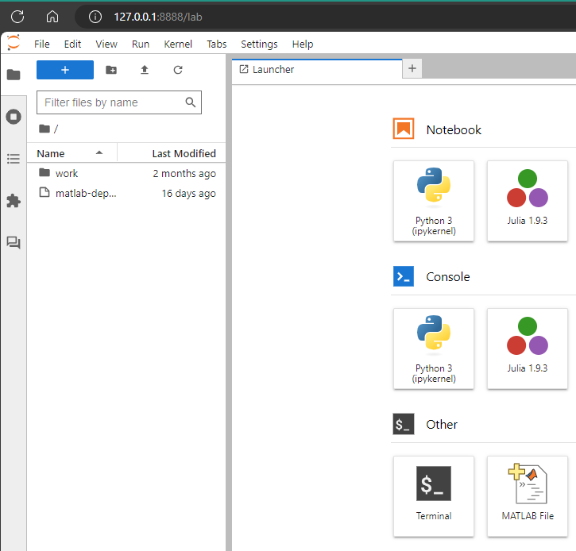

# Interactive Jupyter Lab
This recipe schedules an interactive Jupyter Lab session on VERNE.
This is useful when you need a long-running Jupyter instance and need to quickly change the resource allocations (i.e. CPUs, GPUs, and memory).
By default, a pod is allowed to run for 6 hours, if you need to run for longer than that please email us at csu-tide-support@sdsu.edu.

## Ingredients
- [Local installation of kubectl](../README.md#install-kubectl)
- Jupyter container image
- Jupyter Notebook (optional)
- Two terminal tabs

## Prep
1. Open your terminal and pull up two tabs
1. Set your namespace in an environment variable `ns` in each tab:
    - macOS & Linux:
        - `ns=[your-namespace-here]`
    - Windows (PowerShell)
        - `$ns="[your-namespace-here]"`
    - *Note*: Make sure to remove the brackets '[' & ']'
1. Browse the [available container images](https://csu-tide.github.io/jupyterhub/images) to see what software you want to run
1. Edit the file `jupyter-pod.yml` and replace the value for the `image:` line with the url of your chosen container image

## Instructions
1. Schedule the Jupyter Lab pod onto VERNE:
    - `kubectl -n $ns apply -f jupyter-pod.yml`
    - You should see the following:
        ```
        pod/jupyter-pod created
        ```
1. Check the status of your pod:
    - `kubectl -n $ns get pods`
        - or
    - `kubectl -n $ns get pods --watch`
    - *Note*: The `--watch` option must be ended with `ctrl + c`
    - You should see the following:
        ```
        NAME               READY   STATUS    RESTARTS   AGE
        jupyter-pod        1/1     Running   0          8m50s
        ```
1. Forward the port 8888 from your pod to your local machine:
    - `kubectl -n $ns port-forward jupyter-pod 8888`
    - You should see the following:
        ```
        Forwarding from 127.0.0.1:8888 -> 8888
        Forwarding from [::1]:8888 -> 8888
        ```
    - *Note*: You will need to leave this terminal tab running, so switch to your second one before proceeding
1. Get the URL & token for your Jupyter Lab from your pod:
    - `kubectl -n $ns logs jupyter-pod`
    - You should see the following:
        ```
        To access the server, open this file in a browser:
            file:///home/jovyan/.local/share/jupyter/runtime/jpserver-1-open.html
        Or copy and paste one of these URLs:
            http://jupyter-pod:8888/lab?token=80a5f0fd0b776ed867c0af1bc5d6a87be4d351cd8964bf70
            http://127.0.0.1:8888/lab?token=80a5f0fd0b776ed867c0af1bc5d6a87be4d351cd8964bf70
        ```
    - *Note*: You want the URL that begins with `http://127.0.0.1`
1. Paste the URL into your browser of choice
    - You should see the following:
    - 
    - *Note*: Available software will vary depending on the chosen container image

## Clean Up
1. Close your port-forward terminal tab
1. Stop your Jupyter pod: 
    - You may leave the job running until it reaches the max runtime at which point it will be shut down automatically
        - Or
    - You can tell k8s to shut it down manually with this command:
        - `kubectl -n $ns delete -f jupyter-pod.yml`
